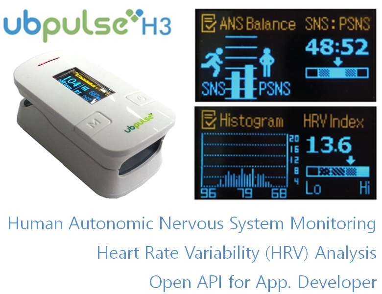
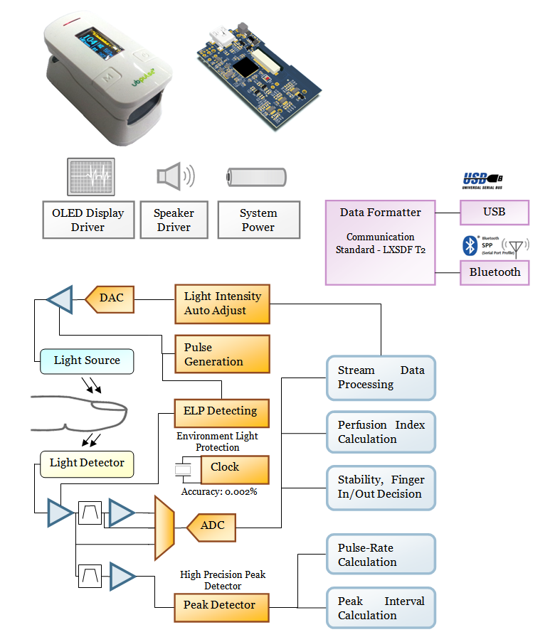

### Features 
- Optical Sensor for Measuring Heart Rate
- Analog front end, Microcontroller, Battery Power Circuit
- OLED Display
- Bluetooth
- Speaker
- Digital Signal Processing
- HRV, ANS Analysis Algorithm
- Clinical Standardization Criteria
- Real Time Bluetooth Communications
- Display Measuring, Analysis Reports

### For App. Developer 
- ubpulse H3 ‘s communication formats are fully opened.
- You can make your own applications  
- medical quality heart rate
- analysed results of ANS(autonomic nervous system)
- and all of data from the ubpulse H3.

### Function Block

## Full Documentation : http://laxtha.net/ubpulse-h3
