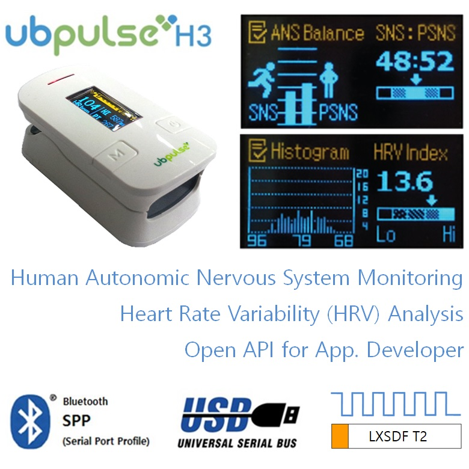
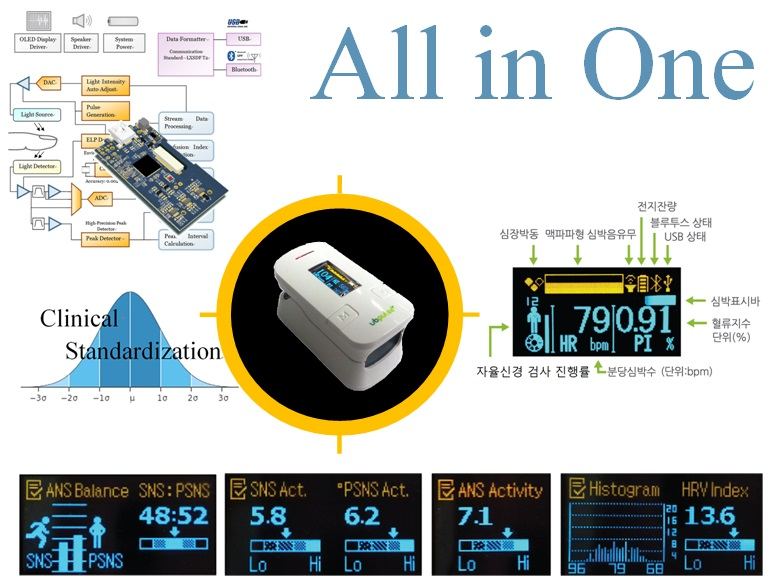
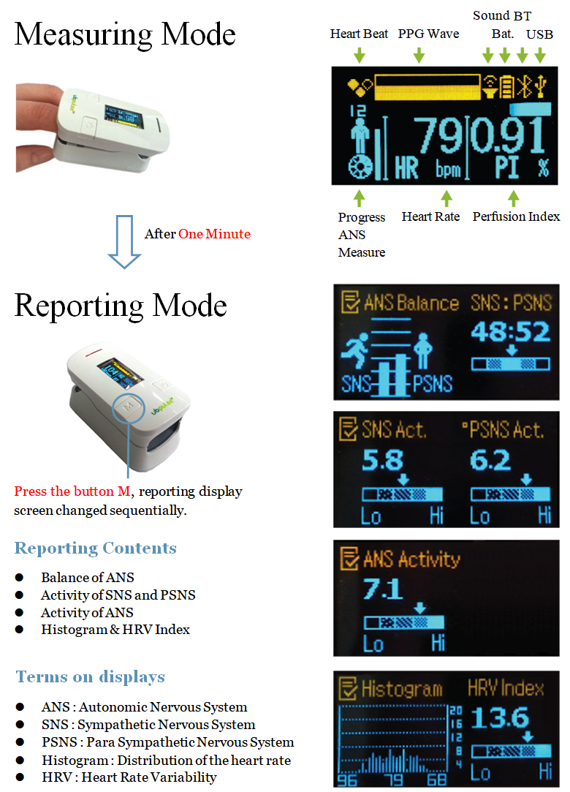
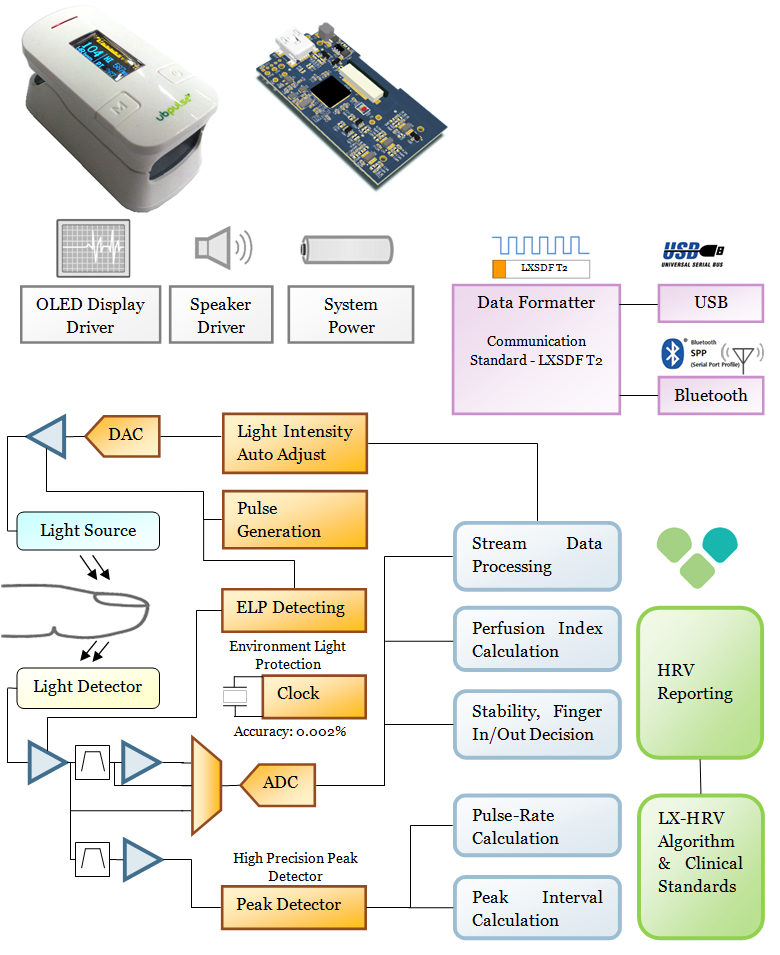
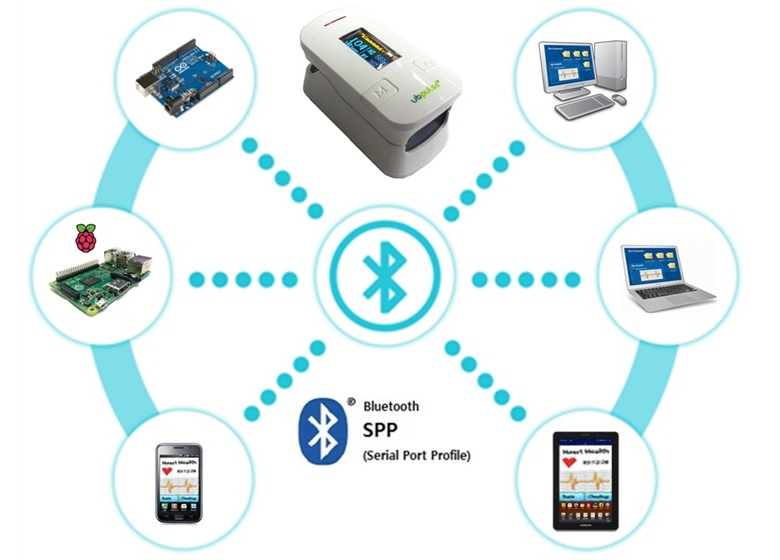
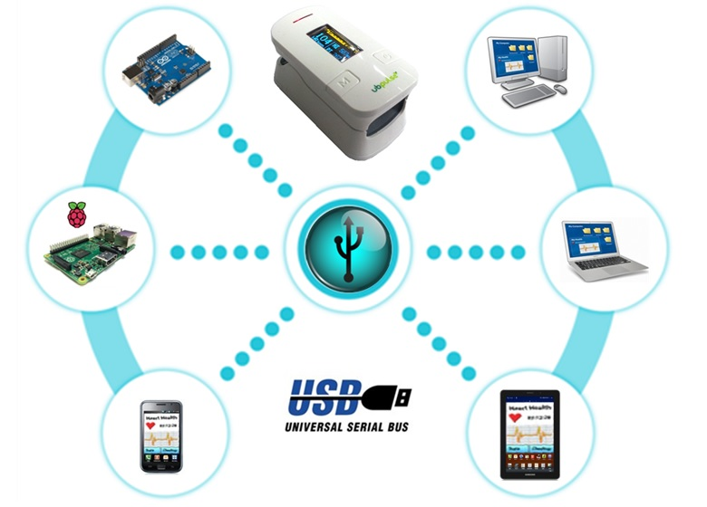

### Features 
- HRV, ANS Analysis Algorithm
- Clinical Standardization Criteria
- Standalone OLED Display Measuring, Analysis Reports
- Optical Sensor for Measuring Heart Rate
- Analog front end, Microcontroller, Battery Power Circuit
- Speaker
- Bluetooth, USB , Real Time Communications

### For App. Developer 
- ubpulse H3 ‘s communication formats are fully opened.
- You can make your own applications  
- medical quality heart rate
- analysed results of ANS(autonomic nervous system)
- and all of data from the ubpulse H3.

### Displays 
- ubpulse H3 built-in OLED displays all information about measuring and ANS reporting.

### Function Block

### Bluetooth Connection
- Bluetooth Profile : SPP(Serial Port Profile)
- It's easy to program with host's serial port access. 

### USB Connection
- USB Class : USB HID (Human Interface Device).
- It's not need to install the device driver manually. 
- All OS(windows, linux, android,.. ) supporting the USB HID device driver by default.

## Full Documentation : http://laxtha.net/ubpulse-h3
